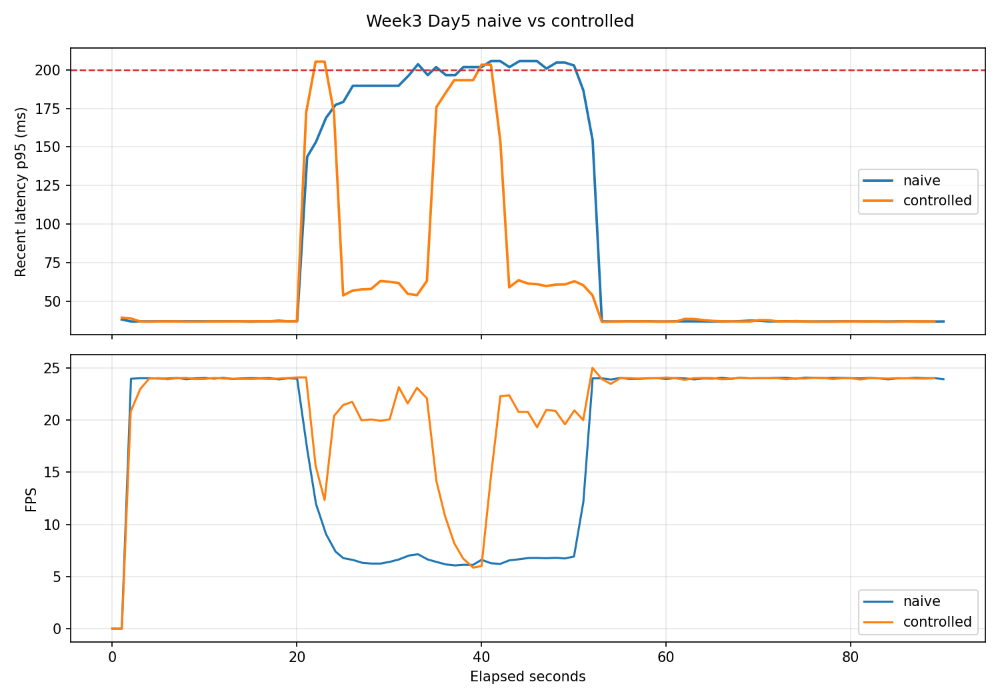

# Edge Inference Guardian

Edge Inference Guardian is a resource-aware control layer for real-time pose
estimation on a Raspberry Pi 5.

It runs MoveNet on live camera frames, watches latency and device resources, and
switches between a heavier and lighter model when the device is under pressure.
The goal is not maximum benchmark speed. The goal is to keep an edge-AI pipeline
usable when CPU load, heat, memory pressure, or camera faults appear.



## Key Result

This is a single Raspberry Pi 5 run per mode. Both runs used the same live USB
camera setup and the same 30-second CPU-stress fault.

| Metric | naive | controlled |
|---|---:|---:|
| Mode | Thunder fixed | ResourceController |
| Duration | 90.029 s | 89.044 s |
| Rolling p95 SLO violations (`recent_latency_p95_ms > 200 ms`) | 15 rows | 4 rows |
| Average rolling p95 latency | 92.114 ms | 62.519 ms |
| Max rolling p95 latency | 205.677 ms | 205.315 ms |
| Average inference time | 77.143 ms | 46.798 ms |
| Average FPS | 17.803 | 21.379 |
| Max CPU temperature | 64.2 C | 61.5 C |
| Throttle rows | 0 | 0 |
| Model switches | 0 | 4 |

The controlled run did not eliminate every SLO violation. It reduced rolling-p95
violations from 15 rows to 4 rows and improved average FPS under the same fault.
Single-frame total latency rows over 200 ms were 6 for naive and 1 for
controlled.

Source: [`docs/week3_controlled_vs_naive.md`](docs/week3_controlled_vs_naive.md)

## Accuracy Trade-off

The project also measures the localization drift introduced by switching from
Thunder to Lightning on the fixed reference clips.

This is a pseudo-ground-truth evaluation: Thunder is treated as the reference
model, and Lightning is compared against it. It does not replace a human-labeled
pose benchmark.

| Metric | Value |
|---|---:|
| Clips | still / slow / fast |
| Evaluated frames | 540 |
| Eligible keypoints | 8,926 |
| PCK@0.05, Thunder pseudo-GT -> Lightning | 0.974 |
| Mean normalized keypoint distance | 0.0130 |
| Thunder average confidence | 0.749 |
| Lightning average confidence | 0.677 |

Source: [`docs/pck_pseudo_gt.md`](docs/pck_pseudo_gt.md)

## What It Does

- Runs MoveNet SinglePose Thunder and Lightning on camera frames.
- Monitors CPU temperature, CPU load, memory, FPS, throttle flags, and optional
  Pi PMIC rail estimates.
- Uses a three-state `ResourceController` (`normal`, `degraded`, `critical`) to
  choose actions.
- Switches Thunder to Lightning when rolling p95 latency exceeds the SLO.
- Injects CPU and memory pressure so the recovery behavior can be measured.
- Writes CSV logs and Markdown summaries for benchmark analysis.

## Architecture

```text
Camera
  -> PoseEstimator
  -> ResourceMonitor
  -> ResourceController
  -> action execution
       - switch model
       - skip frame
       - force GC
  -> CSV / summary docs
```

The main loop is intentionally simple: read a fresh frame, take a resource
snapshot, evaluate the controller, apply the action, run inference, then log the
result.

## How The Controller Works

The controller has three states:

```text
normal
  -> degraded
       when CPU temp >= 70 C, memory >= 80%, or rolling p95 latency > 200 ms

degraded
  -> critical
       when CPU temp >= 80 C, memory >= 90%, or the Pi reports throttling

degraded
  -> normal
       only after recovery conditions hold for 10 seconds

critical
  -> degraded
       only after recovery conditions hold for 15 seconds
```

The hysteresis is deliberate. Without it, the system can oscillate between
Thunder and Lightning when latency or temperature hovers near a threshold.

In the current CPU-stress comparison, the controlled run switched:

- `switch_to_light`: 2 times
- `switch_to_heavy`: 2 times

That means the controller recovered once while the fault was still active, then
degraded again. This is useful evidence, but it also shows a tuning opportunity:
a future tuning pass should evaluate a longer recovery hold time or a CPU-usage
recovery condition.

## Fault Injection

Implemented scenarios:

| Scenario | Status | Purpose |
|---|---|---|
| `cpu_stress` | measured on Pi | Create latency pressure without relying on heat |
| `memory_pressure` | implemented, not yet used for the main comparison | Exercise `critical` behavior and forced cleanup |
| `camera_disconnect` | placeholder | Future scenario for stale-frame / reconnect handling |

The CPU-stress path uses `stress-ng` when available and falls back to Python
busy-loop workers. Fault processes are separate child processes and are cleaned
up with `clear_all()`.

## Run It

This project targets Python 3.10-3.11. The Raspberry Pi run used Raspberry Pi OS
Bookworm, Python 3.11, `ai-edge-litert`, a USB webcam, active cooling, and a
5V/5A power supply.

```bash
python3 -m venv .venv
source .venv/bin/activate
python -m pip install -e ".[dev]"
./models/download_models.sh
```

Run a short monitored demo:

```bash
python examples/run_monitored.py \
  --device 0 \
  --model thunder \
  --no-display \
  --duration 70 \
  --csv-output metrics/day4_pi_thunder.csv
```

Run the Week 3 comparison on the Pi:

```bash
python examples/run_controlled.py \
  --device 0 \
  --model thunder \
  --controller-mode naive \
  --no-display \
  --duration 90 \
  --csv-output metrics/week3_day5_pi_naive_cpu_stress_workers8.csv \
  --no-plot \
  --fault-scenario cpu_stress \
  --fault-start-after 20 \
  --fault-duration 30 \
  --fault-cpu-workers 8

python examples/run_controlled.py \
  --device 0 \
  --model thunder \
  --controller-mode controlled \
  --no-display \
  --duration 90 \
  --csv-output metrics/week3_day5_pi_controlled_cpu_stress_workers8.csv \
  --no-plot \
  --fault-scenario cpu_stress \
  --fault-start-after 20 \
  --fault-duration 30 \
  --fault-cpu-workers 8
```

Compare the two CSV files:

```bash
python examples/compare_control_runs.py \
  --naive-csv metrics/week3_day5_pi_naive_cpu_stress_workers8.csv \
  --controlled-csv metrics/week3_day5_pi_controlled_cpu_stress_workers8.csv \
  --markdown-output docs/week3_controlled_vs_naive.md \
  --plot-output metrics/plots/week3_day5_naive_vs_controlled.png
```

Raw CSVs, plots under `metrics/`, TFLite model files, and reference clips are
local benchmark artifacts and are intentionally ignored by Git.

## Repository Layout

```text
src/
  camera.py               Threaded OpenCV camera capture
  pose_estimator.py       MoveNet Thunder/Lightning wrapper
  resource_monitor.py     CPU, memory, FPS, throttle, and power snapshots
  resource_controller.py  State machine and control actions
  fault_injector.py       CPU and memory pressure injection
  metrics_collector.py    Placeholder for Week 4 summary export

examples/
  run_demo.py             Live pose demo
  run_monitored.py        Live inference with resource CSV logging
  run_controlled.py       Live inference with ResourceController actions
  compare_control_runs.py Compare naive and controlled CSVs

docs/
  week3_controlled_vs_naive.md
  pck_pseudo_gt.md
  assets/week3_day5_naive_vs_controlled.png
```

## Current Status

Phase 1 has a complete baseline:

- Week 1: Mac MoveNet demo, camera loop, `PoseEstimator`, reference clips.
- Week 2: Raspberry Pi bootstrapping, Pi inference, resource monitoring, CSV
  logging, 10-minute stability run.
- Week 3: `ResourceController`, hysteresis, live action execution,
  `FaultInjector`, and one Pi naive-vs-controlled comparison.
- Phase 1 wrap-up: English README and fixed-clip PCK pseudo-ground-truth
  evaluation.

## Limitations

- The key result is one run per mode on one Raspberry Pi 5.
- The current comparison uses live camera input, so lighting and pose are not as
  controlled as fixed-clip inference.
- `light-only` comparison mode is not in the main result table yet.
- PCK is measured only as Thunder pseudo-ground-truth vs Lightning. Human-labeled
  ground truth is not available yet.
- `memory_pressure` is implemented but has not been used for the main
  comparison table.
- `camera_disconnect` is not wired into the camera loop yet.
- The controller reduced SLO violations but did not eliminate them.

## Roadmap

- Add `MetricsCollector` JSON summaries and multi-run comparison.
- Add a `light-only` baseline.
- Add human-labeled or external-dataset pose accuracy evaluation.
- Tune recovery behavior after the observed extra Thunder/Lightning switch.
- Add a short demo GIF after the README result graph is stable.
- Phase 2: build gesture control on top of the same pose pipeline.
- Phase 3: reuse the pose pipeline for a small robot-arm follow project.

## License

MIT
