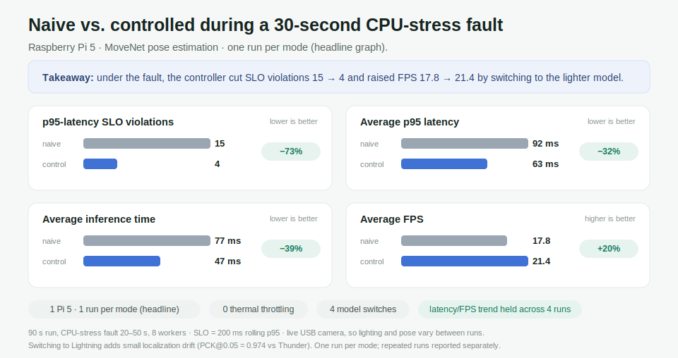
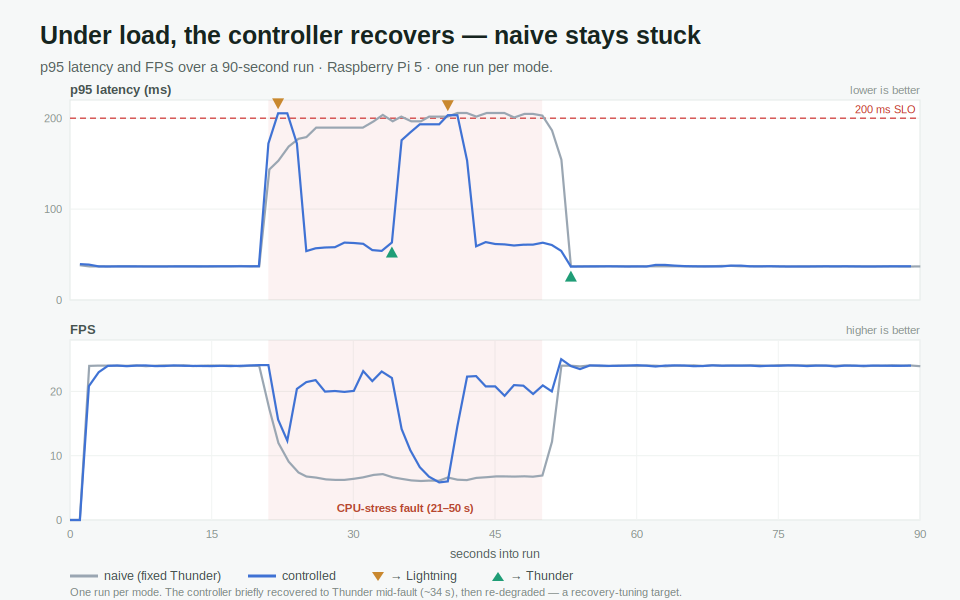
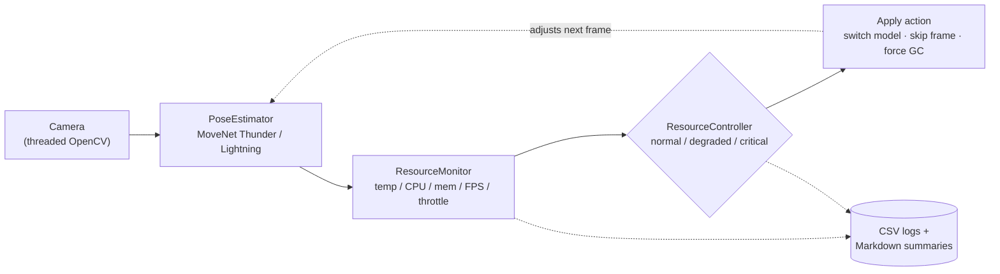
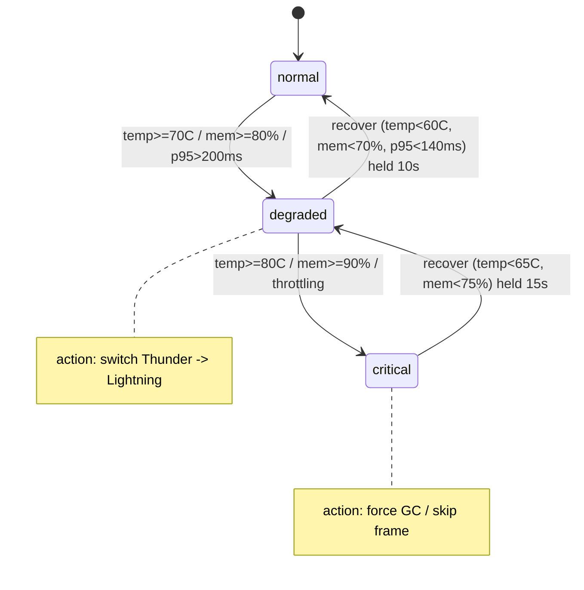

# Pose Guardian

**A resource-aware control layer for real-time pose estimation on the Raspberry Pi 5.**
It runs MoveNet on a live camera, watches latency and device resources, and
switches between a heavier and a lighter model when the device is under pressure
— so the pipeline stays usable instead of stalling.

[](LICENSE)


> **Part of the Edge Guardian series** — resource-aware adaptive model switching on the Raspberry Pi 5. Sibling project: [**Thermal Guardian**](https://github.com/ryokotaka/thermal-guardian), a thermal-aware Q8/Q4 LLM router for the same device. Same core idea (shed load gracefully under pressure), two domains: vision and LLM.

---

## In one minute

A Raspberry Pi 5 is a small, low-power computer about the size of a deck of
cards. Pose Guardian uses it to do real-time **pose estimation** — tracking where
a person's body joints are, frame by frame, from a live USB camera, entirely
on-device.

The hard part on a small device isn't running the model once; it's staying
usable when the device is under pressure. If the CPU gets busy, hot, or low on
memory, inference slows down, latency climbs, and the live feed turns choppy or
stale. A pose tracker that stutters at the worst moment isn't much use.

Pose Guardian logs CPU load and watches the signals that directly drive the
controller — rolling latency, temperature, memory, and Pi throttle flags. When
those signals degrade, it automatically switches from the heavier, more accurate
model (**MoveNet Thunder**) to a lighter, faster one (**MoveNet Lightning**),
then switches back once recovery conditions hold. It's the same instinct as a car
downshifting on a hill: trade a little precision to stay responsive, then shift
back up.

The project is built to measure that trade-off **honestly**. The headline result
is deliberately specific: under an injected 30-second CPU-stress fault, switching
to the lighter model cut latency-SLO violations and recovered frame rate — and
the cost of switching (a small drop in pose precision) is measured separately,
not swept under the rug.

## Results at a glance

Under a 30-second CPU-stress fault, "naive" stays locked on the heavy model;
"controlled" lets the guardian react.



You can also see it over time — the fault runs from 20 s to 50 s. Without control,
latency spikes and stays high; with control, the system drops to the lighter
model, recovers, and returns to the heavy model once recovery conditions hold:



| Metric (90 s run, 30 s fault) | naive | controlled |
| --- | ---: | ---: |
| Model under load | Thunder (fixed) | auto Thunder ↔ Lightning |
| p95-latency SLO violations¹ | 15 | **4** |
| Average p95 latency | 92 ms | **63 ms** |
| Average inference time | 77 ms | **47 ms** |
| Average FPS | 17.8 | **21.4** |
| Max CPU temperature | 64 °C | 62 °C |
| Model switches | 0 | 4 |

¹ Each run logs one row per second (~90 rows); a violation is a row whose rolling
p95 latency (`recent_latency_p95_ms`) exceeds the 200 ms SLO. By a stricter
single-frame measure (`inference_ms + preprocess_ms > 200 ms`), violations were
**6 (naive) vs 1 (controlled)**.

**How to read this honestly:** this is one run per mode on one Raspberry Pi 5,
under CPU/latency stress only — no thermal throttling occurred (max 64 °C). The
controller did *not* eliminate every violation, and both modes hit a similar
one-off ~205 ms p95 spike the instant the fault starts, before the controller can
react. The benefit is in how fast each run recovers afterward. The trend held
across four repeated paired runs (see [Evaluation](#evaluation)).

## Why this exists

A small edge device can run a capable vision model, but a fixed pipeline has no
answer when the device is squeezed: it just gets slower. This project asks
concrete questions:

- Can a Raspberry Pi 5 run real-time MoveNet pose estimation from a live camera?
- Can a controller detect resource/latency pressure and switch to a lighter model
  fast enough to protect responsiveness?
- Can it recover to the higher-quality model without oscillating?
- Can the whole thing be measured — both the benefit (latency/FPS) and the cost
  (pose precision) — rather than asserted?

## How it works

The main loop is intentionally simple: read a fresh frame, take a resource
snapshot, evaluate the controller, apply the action, run inference, then log it.



The `ResourceController` is a three-state machine. Pressure pushes it **up**
immediately; recovery uses *lower* thresholds plus a hold timer, so it does not
flap back and forth near a boundary (this gap is the hysteresis):



In the headline CPU-stress run the controller switched four times
(`switch_to_light` ×2, `switch_to_heavy` ×2): it recovered to Thunder once while
the fault was still active, then degraded again. That is useful evidence and also
a clear tuning target — a longer recovery hold or a CPU-usage recovery condition
should reduce the extra round-trip.

## Evaluation

**Headline run** — Raspberry Pi 5 with active cooler, live USB camera, initial
model Thunder, 90 s per mode, `cpu_stress` fault from 20–50 s with 8 workers,
SLO = 200 ms rolling p95.

**Repeated runs** — the same paired experiment was run four times total to check
the trend:

| Aggregate (4 paired runs) | naive | controlled |
| --- | ---: | ---: |
| Total p95-SLO violation rows | 35 | 14 |
| Average p95 latency | 93.2 ms | 64.9 ms |
| Average inference time | 77.3 ms | 49.6 ms |
| Average FPS | 13.4 | 15.4 |
| Thermal throttle rows | 0 | 0 |

What the experiment **shows**:

- Real-time MoveNet pose estimation runs on the Pi 5 from a live camera.
- Under CPU-stress latency pressure, the controller lowered average p95 latency,
  inference time, and SLO violations and raised FPS — in all four paired runs for
  latency/inference/FPS.
- The controller switched to Lightning under pressure and recovered to Thunder
  afterward, without thermal throttling in any run.

What it **does not prove**:

- It is a small live-camera sample (one headline run per mode; four paired runs
  total), not a large benchmark.
- SLO-row reduction is an *aggregate* result — one of the four pairs had more SLO
  rows under control, so this is not a per-run guarantee.
- It is a CPU/latency-pressure result, not a thermal-throttling result (no run
  throttled).
- `memory_pressure` has only a smoke test; `camera_disconnect` is not wired in
  yet.
- Live camera input means lighting and pose vary between runs.

## Accuracy trade-off

Switching to Lightning is not free — it shifts where joints land. This is a
**pseudo-ground-truth** evaluation on fixed reference clips: Thunder is treated as
the reference and Lightning is compared against it. It measures switching drift,
not absolute human-pose accuracy.

| Metric | Value |
| --- | ---: |
| Clips | still / slow / fast |
| Evaluated frames | 540 |
| Eligible keypoints | 8,926 |
| PCK@0.05 (Thunder pseudo-GT → Lightning) | 0.974 |
| Mean normalized keypoint distance | 0.0130 |
| Thunder average confidence | 0.749 |
| Lightning average confidence | 0.677 |

In plain terms: ~97% of Lightning's keypoints land within 5% of the image
diagonal of Thunder's. The lighter model is close but not identical — an
acceptable trade for staying responsive under load, and a number a future
human-labeled benchmark can refine.

Source: [`docs/pck_pseudo_gt.md`](docs/pck_pseudo_gt.md).

## Run it

This project targets Python 3.10–3.11. The Pi run used Raspberry Pi OS Bookworm,
Python 3.11, `ai-edge-litert`, a USB webcam, active cooling, and a 5V/5A supply.

```bash
python3 -m venv .venv
source .venv/bin/activate
python -m pip install -e ".[dev]"
./models/download_models.sh
```

<details>
<summary>Reproduce the naive-vs-controlled comparison on a Pi</summary>

Run each mode (swap `--controller-mode naive` / `controlled`):

```bash
python examples/run_controlled.py \
  --device 0 --model thunder --controller-mode controlled \
  --no-display --duration 90 --no-plot \
  --csv-output metrics/controlled_cpu_stress.csv \
  --fault-scenario cpu_stress --fault-start-after 20 \
  --fault-duration 30 --fault-cpu-workers 8
```

Then compare the two CSVs into the summary doc and plot:

```bash
python examples/compare_control_runs.py \
  --naive-csv metrics/naive_cpu_stress.csv \
  --controlled-csv metrics/controlled_cpu_stress.csv \
  --markdown-output docs/controlled_vs_naive.md \
  --plot-output docs/assets/naive_vs_controlled_cpu_stress.png
```

Raw CSVs, plots under `metrics/`, TFLite model files, and reference clips are
local benchmark artifacts and are intentionally ignored by Git.

</details>

## Repository layout

```text
src/
  camera.py               Threaded OpenCV camera capture
  pose_estimator.py       MoveNet Thunder/Lightning wrapper
  resource_monitor.py     CPU, memory, FPS, throttle, and power snapshots
  resource_controller.py  Three-state machine and control actions
  fault_injector.py       CPU and memory pressure injection
  metrics_collector.py    Summary export (not yet implemented)

examples/
  run_monitored.py        Live inference with resource CSV logging
  run_controlled.py       Live inference with ResourceController actions
  compare_control_runs.py Compare naive and controlled CSVs

docs/
  controlled_vs_naive.md          headline run summary
  repeated_cpu_stress.md          four paired runs
  memory_pressure_smoke.md        memory-pressure smoke test
  pck_pseudo_gt.md                accuracy trade-off
  assets/                         figures used in this README
```

## Limitations

- The headline graph is one run per mode on one Raspberry Pi 5; repeated runs are
  summarized separately.
- Live camera input means lighting and pose are less controlled than fixed-clip
  inference.
- A `light-only` baseline is not in the main result table yet.
- PCK is Thunder pseudo-ground-truth vs Lightning only; no human-labeled ground
  truth yet.
- `memory_pressure` has only a smoke test; `camera_disconnect` is not wired into
  the camera loop yet.
- The controller reduced SLO violations but did not eliminate them.

## Roadmap

- `MetricsCollector` JSON summaries and automated multi-run comparison.
- A `light-only` baseline for the main table.
- Human-labeled or external-dataset pose accuracy evaluation.
- Tune recovery behavior to remove the extra Thunder/Lightning round-trip.
- A short demo GIF once the result graph is stable.
- Robot-arm follow project: reuse the pose pipeline and controller as a safety
  layer around small actuator commands.

## License

MIT — see [`LICENSE`](LICENSE). MoveNet model weights are downloaded separately
and are governed by their own license.
