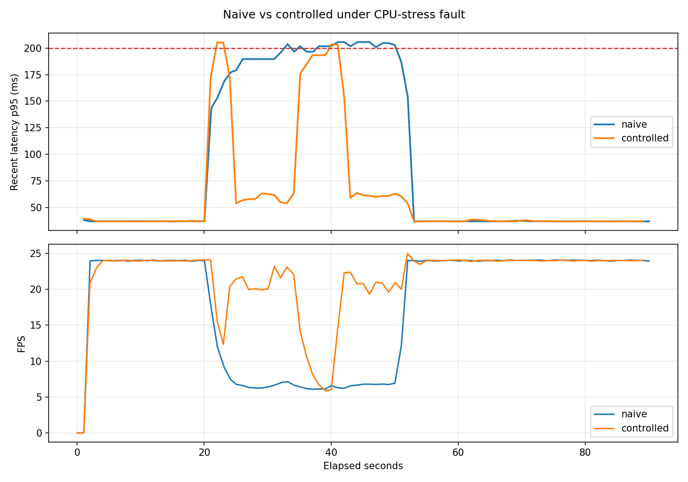

# Edge Inference Guardian

Edge Inference Guardian is a resource-aware control layer for real-time pose
estimation on a Raspberry Pi 5.

It runs MoveNet on live camera frames, watches latency and device resources, and
switches between a heavier and lighter model when the device is under pressure.
The goal is not maximum benchmark speed. The goal is to keep an edge-AI pipeline
usable when CPU load, heat, memory pressure, or camera faults appear.



*The fault runs from 20s to 50s. Without control (naive), the system stays on the
heavy model and latency spikes; with control, it drops to the lighter model and
recovers, then returns to the heavy model once the load clears.*

## Key Result

**Under a 30-second CPU-stress fault, the controller cut p95 latency SLO
violations from 15 to 4 and raised average FPS from 17.8 to 21.4 — by switching
to a lighter model and recovering automatically.**

One Raspberry Pi 5, one run per mode, same live USB camera, same fault. This run
stresses CPU and latency only; no thermal throttling occurred (max 64 °C). The
memory-pressure path is implemented but not part of the main comparison yet.

| Metric (90 s run, 30 s fault) | naive | controlled |
|---|---:|---:|
| Model under load | Thunder (fixed) | auto Thunder ↔ Lightning |
| p95 latency SLO violations¹ | 15 | 4 |
| Average p95 latency | 92 ms | 63 ms |
| Average inference time | 77 ms | 47 ms |
| Average FPS | 17.8 | 21.4 |
| Max CPU temperature | 64 °C | 62 °C |
| Model switches | 0 | 4 |

¹ Each run logs one row per second (~90 rows). A violation is a row whose rolling
p95 latency (`recent_latency_p95_ms`) exceeds the 200 ms SLO. By a stricter
single-frame measure (`inference_ms + preprocess_ms > 200 ms`), violations were
6 (naive) vs 1 (controlled).

The controlled run did not eliminate every violation. Both modes also hit a
similar one-off p95 spike (~205 ms) at the instant the fault starts, before the
controller can react; the benefit shows up in how fast each run recovers
afterward.

Source: [`docs/controlled_vs_naive.md`](docs/controlled_vs_naive.md)

## Repeated CPU-Stress Runs

The same paired Pi CPU-stress experiment was repeated three more times. Across
four paired runs, controlled mode improved average p95 latency, inference time,
and FPS in every pair. SLO rows improved in three of four pairs and fell in
aggregate from 35 rows to 14 rows.

| Aggregate metric | naive | controlled |
|---|---:|---:|
| Total p95 SLO violation rows | 35 | 14 |
| Average p95 latency | 93 ms | 65 ms |
| Average inference time | 77 ms | 50 ms |
| Average FPS | 13.4 | 15.4 |
| Thermal throttle rows | 0 | 0 |

The repeated runs are still a small live-camera sample, not a large benchmark.
They support an aggregate latency/FPS improvement under CPU-stress-induced
latency pressure. They do not prove that every individual run reduces SLO rows.

Source: [`docs/repeated_cpu_stress.md`](docs/repeated_cpu_stress.md)

## Accuracy Trade-off

The project also measures the localization drift introduced by switching from
Thunder to Lightning on the fixed reference clips.

This is a pseudo-ground-truth evaluation: Thunder is treated as the reference
model, and Lightning is compared against it. It does not replace a human-labeled
pose benchmark.

| Metric | Value |
|---|---:|
| Clips | still / slow / fast |
| Evaluated frames | 540 |
| Eligible keypoints | 8,926 |
| PCK@0.05, Thunder pseudo-GT -> Lightning | 0.974 |
| Mean normalized keypoint distance | 0.0130 |
| Thunder average confidence | 0.749 |
| Lightning average confidence | 0.677 |

Source: [`docs/pck_pseudo_gt.md`](docs/pck_pseudo_gt.md)

## What It Does

- Runs MoveNet SinglePose Thunder and Lightning on camera frames.
- Monitors CPU temperature, CPU load, memory, FPS, throttle flags, and optional
  Pi PMIC rail estimates.
- Uses a three-state `ResourceController` (`normal`, `degraded`, `critical`) to
  choose actions.
- Switches Thunder to Lightning when rolling p95 latency exceeds the SLO.
- Injects CPU and memory pressure so the recovery behavior can be measured.
- Writes CSV logs and Markdown summaries for benchmark analysis.

## Architecture

```text
Camera
  -> PoseEstimator
  -> ResourceMonitor
  -> ResourceController
  -> action execution
       - switch model
       - skip frame
       - force GC
  -> CSV / summary docs
```

The main loop is intentionally simple: read a fresh frame, take a resource
snapshot, evaluate the controller, apply the action, run inference, then log the
result.

## How The Controller Works

The controller has three states:

```text
normal
  -> degraded
       when CPU temp >= 70 C, memory >= 80%, or rolling p95 latency > 200 ms

degraded
  -> critical
       when CPU temp >= 80 C, memory >= 90%, or the Pi reports throttling

degraded
  -> normal
       only after recovery conditions hold for 10 seconds

critical
  -> degraded
       only after recovery conditions hold for 15 seconds
```

The hysteresis is deliberate. Without it, the system can oscillate between
Thunder and Lightning when latency or temperature hovers near a threshold.

In the current CPU-stress comparison, the controlled run switched:

- `switch_to_light`: 2 times
- `switch_to_heavy`: 2 times

That means the controller recovered once while the fault was still active, then
degraded again. This is useful evidence, but it also shows a tuning opportunity:
a future tuning pass should evaluate a longer recovery hold time or a CPU-usage
recovery condition.

## Fault Injection

Implemented scenarios:

| Scenario | Status | Purpose |
|---|---|---|
| `cpu_stress` | measured on Pi across four paired runs | Create latency pressure without relying on heat |
| `memory_pressure` | smoke-tested on Pi | Trigger memory-based degradation and recovery |
| `camera_disconnect` | placeholder | Future scenario for stale-frame / reconnect handling |

The CPU-stress path uses `stress-ng` when available and falls back to Python
busy-loop workers. Fault processes are separate child processes and are cleaned
up with `clear_all()`.

The memory-pressure smoke test reached about 84% memory usage, triggered
`normal -> degraded`, switched Thunder to Lightning, then recovered back to
Thunder after the fault cleared. It did not exercise the `critical` / `force_gc`
path.

Source: [`docs/memory_pressure_smoke.md`](docs/memory_pressure_smoke.md)

## Run It

This project targets Python 3.10-3.11. The Raspberry Pi run used Raspberry Pi OS
Bookworm, Python 3.11, `ai-edge-litert`, a USB webcam, active cooling, and a
5V/5A power supply.

```bash
python3 -m venv .venv
source .venv/bin/activate
python -m pip install -e ".[dev]"
./models/download_models.sh
```

Run a short monitored demo:

```bash
python examples/run_monitored.py \
  --device 0 \
  --model thunder \
  --no-display \
  --duration 70 \
  --csv-output metrics/monitored_thunder.csv
```

Run the naive-vs-controlled comparison on the Pi:

```bash
python examples/run_controlled.py \
  --device 0 \
  --model thunder \
  --controller-mode naive \
  --no-display \
  --duration 90 \
  --csv-output metrics/naive_cpu_stress.csv \
  --no-plot \
  --fault-scenario cpu_stress \
  --fault-start-after 20 \
  --fault-duration 30 \
  --fault-cpu-workers 8

python examples/run_controlled.py \
  --device 0 \
  --model thunder \
  --controller-mode controlled \
  --no-display \
  --duration 90 \
  --csv-output metrics/controlled_cpu_stress.csv \
  --no-plot \
  --fault-scenario cpu_stress \
  --fault-start-after 20 \
  --fault-duration 30 \
  --fault-cpu-workers 8
```

Compare the two CSV files:

```bash
python examples/compare_control_runs.py \
  --naive-csv metrics/naive_cpu_stress.csv \
  --controlled-csv metrics/controlled_cpu_stress.csv \
  --markdown-output docs/controlled_vs_naive.md \
  --plot-output docs/assets/naive_vs_controlled_cpu_stress.png
```

Raw CSVs, plots under `metrics/`, TFLite model files, and reference clips are
local benchmark artifacts and are intentionally ignored by Git.

## Repository Layout

```text
src/
  camera.py               Threaded OpenCV camera capture
  pose_estimator.py       MoveNet Thunder/Lightning wrapper
  resource_monitor.py     CPU, memory, FPS, throttle, and power snapshots
  resource_controller.py  State machine and control actions
  fault_injector.py       CPU and memory pressure injection
  metrics_collector.py    Summary export (not yet implemented)

examples/
  run_demo.py             Live pose demo
  run_monitored.py        Live inference with resource CSV logging
  run_controlled.py       Live inference with ResourceController actions
  compare_control_runs.py Compare naive and controlled CSVs

docs/
  controlled_vs_naive.md
  repeated_cpu_stress.md
  memory_pressure_smoke.md
  pck_pseudo_gt.md
  assets/naive_vs_controlled_cpu_stress.png
```

## Current Status

Phase 1 has a complete baseline, built in this order:

- Pose estimation pipeline (MoveNet Thunder/Lightning) on macOS, then ported to
  the Raspberry Pi.
- On-device resource monitoring and CSV logging, including a 10-minute stability
  run.
- A three-state `ResourceController` with hysteresis and live action execution,
  plus a `FaultInjector`.
- Four paired naive-vs-controlled CPU-stress runs on the Pi, one memory-pressure
  smoke test, and a fixed-clip PCK pseudo-ground-truth evaluation.

## Limitations

- The headline graph is one run per mode on one Raspberry Pi 5; repeated
  CPU-stress runs are summarized separately.
- The current comparison uses live camera input, so lighting and pose are not as
  controlled as fixed-clip inference.
- `light-only` comparison mode is not in the main result table yet.
- PCK is measured only as Thunder pseudo-ground-truth vs Lightning. Human-labeled
  ground truth is not available yet.
- `memory_pressure` has only a smoke test so far; it has not been benchmarked
  against a naive baseline.
- `camera_disconnect` is not wired into the camera loop yet.
- The controller reduced SLO violations but did not eliminate them.

## Roadmap

- Add `MetricsCollector` JSON summaries and automate multi-run comparison.
- Add a `light-only` baseline.
- Add human-labeled or external-dataset pose accuracy evaluation.
- Tune recovery behavior after the observed extra Thunder/Lightning switch.
- Add a short demo GIF after the README result graph is stable.
- Phase 2: build gesture control on top of the same pose pipeline.
- Phase 3: reuse the pose pipeline for a small robot-arm follow project.

## License

MIT
